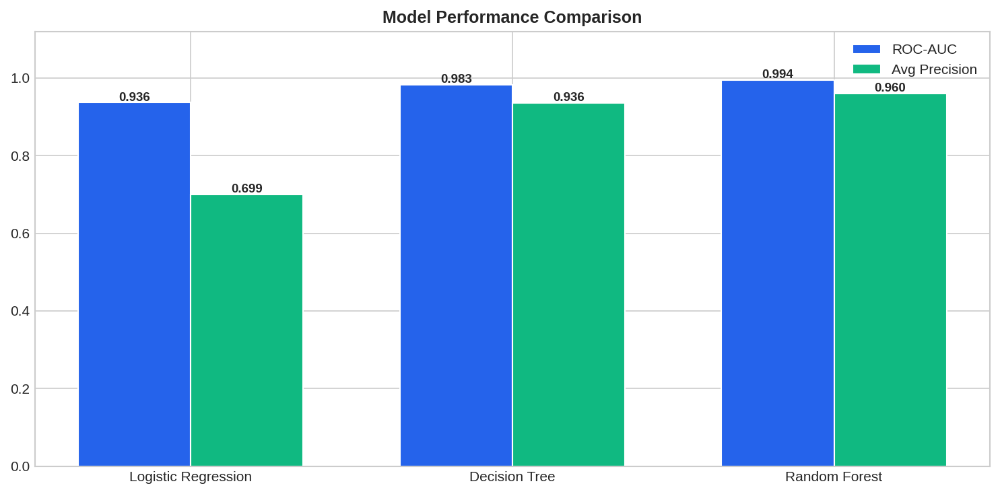

<div align="center">

# 🛡️ FraudShield AI
### Credit Card Fraud Detection System

[](https://python.org)
[](https://flask.palletsprojects.com)
[](https://scikit-learn.org)
[](LICENSE)

**An end-to-end ML system that detects fraudulent credit card transactions in real time.**  
Trained on **1.85 million** real-world transactions · **Random Forest AUC 0.9941** · Interactive Flask dashboard

[📊 View Notebook](#notebook) · [🚀 Quick Start](#quick-start) · [📡 API Reference](#api-reference)

---



</div>

---

## 📌 Overview

Credit card fraud costs the global economy over **$32 billion per year**. This project implements a complete machine learning pipeline — from raw transaction data to a production-ready web application — that classifies transactions as fraudulent or legitimate in under **50 ms**.

### ✨ Key Highlights

| Feature | Detail |
|---|---|
| 🗃️ **Dataset** | 1.85M real-world transactions (Jan 2019–Dec 2020) |
| 🤖 **Models** | Logistic Regression · Decision Tree · **Random Forest** (best) |
| 📊 **Best AUC** | **0.9941** (Random Forest) |
| 🎯 **Fraud F1** | **0.9048** — catches 93% of fraud with 88% precision |
| ⚡ **Inference** | < 50 ms per transaction |
| 🌐 **Interface** | Responsive Flask dashboard with real-time prediction |
| 📈 **Visualizations** | 9 publication-quality charts embedded in Jupyter notebook |

---

## 🗂️ Project Structure

```
fraud_detection/
│
├── 📓 FraudDetection_Analysis.ipynb   ← Full EDA + training notebook (run this first)
├── 🐍 app.py                           ← Flask REST API application
├── 📄 description.md                   ← Pipeline diagrams & system docs
├── 📄 README.md                        ← You are here
├── 📄 requirements.txt                 ← Python dependencies
│
├── templates/
│   └── index.html                      ← Responsive web dashboard
│
└── outputs/                            ← Generated by notebook
    ├── best_model.pkl                  ← Serialized Random Forest + scaler
    ├── results_summary.json            ← Model metrics (all 3 models)
    ├── class_distribution.png
    ├── amount_category.png
    ├── temporal_patterns.png
    ├── correlation_heatmap.png
    ├── feature_importance.png
    ├── confusion_matrices.png
    ├── roc_pr_curves.png
    ├── model_comparison.png
    └── age_distribution.png
```

---

## 🚀 Quick Start

### 1. Clone & Install

```bash
git clone https://github.com/yourusername/fraud-detection.git
cd fraud-detection
pip install -r requirements.txt
```

### 2. Run the Notebook (trains models & generates plots)

```bash
jupyter notebook FraudDetection_Analysis.ipynb
# Run All Cells → outputs/best_model.pkl is created
```

### 3. Launch the Web App

```bash
python app.py
```

Open **http://localhost:5000** in your browser.

---

## 📊 Dataset

The dataset contains anonymized credit card transactions with the following features:

| Column | Type | Description |
|---|---|---|
| `trans_date_trans_time` | datetime | Transaction timestamp |
| `amt` | float | Transaction amount ($) |
| `category` | string | Merchant category (14 categories) |
| `lat`, `long` | float | Cardholder location |
| `merch_lat`, `merch_long` | float | Merchant location |
| `city_pop` | int | City population |
| `dob` | date | Cardholder date of birth |
| `gender` | string | M / F |
| `is_fraud` | int | **Target** — 0 = legitimate, 1 = fraud |

### Engineered Features

The notebook derives **16 features** from the raw 23 columns:

- **Temporal:** `hour`, `day_of_week`, `month`, `is_weekend`, `is_night`
- **Demographics:** `age` (derived from dob)
- **Geospatial:** `distance` (Euclidean distance card-holder ↔ merchant)
- **Encoded:** `gender_enc`, `category_enc`
- **Transformed:** `amt_log` (log1p of amount)

---

## 🤖 Models & Results

All models use `class_weight='balanced'` to handle the severe class imbalance (only 0.52% fraud).

| Model | AUC-ROC | Avg Precision | Fraud Precision | Fraud Recall | Fraud F1 | Accuracy |
|---|---|---|---|---|---|---|
| Logistic Regression | 0.9364 | 0.6992 | 0.4794 | 0.7753 | 0.5924 | 92.33% |
| Decision Tree | 0.9828 | 0.9363 | 0.7281 | 0.9636 | 0.8295 | 97.15% |
| **Random Forest** ⭐ | **0.9941** | **0.9604** | **0.8805** | **0.9305** | **0.9048** | **98.59%** |

### Why Random Forest wins

- **Ensemble learning** reduces variance via bagging over 100 trees
- **Non-linear** — captures complex amount × category × time interactions
- **Robust** to outliers (large fraudulent amounts don't destabilise training)
- **Calibrated probabilities** for risk scoring (not just binary output)

---

## 📡 API Reference

The Flask app exposes a REST API:

### `POST /predict`
Classify a single transaction.

```json
{
  "amt": 1249.99,
  "category": "misc_net",
  "trans_datetime": "2024-01-15T03:22:00",
  "dob": "1985-06-15",
  "gender": "M",
  "city_pop": 1200,
  "lat": 36.08, "long": -81.18,
  "merch_lat": 42.10, "merch_long": -71.50
}
```

**Response:**

```json
{
  "status": "success",
  "result": {
    "fraud_probability": 94.37,
    "prediction": "FRAUD",
    "risk_level": "CRITICAL",
    "confidence": 88.7,
    "risk_factors": [
      {"factor": "High Transaction Amount", "impact": "high", "detail": "$1249.99 far above average of ~$67"},
      {"factor": "Late-Night Transaction",  "impact": "high", "detail": "Time 03:22 — peak fraud window"}
    ],
    "model_used": "Random Forest"
  }
}
```

### `GET /api/stats`
Dataset and model summary statistics.

### `GET /api/model_metrics`
Full per-model performance metrics.

### `POST /api/batch_predict`
Classify up to 100 transactions at once.

### `GET /health`
Service health check.

---

## 🔑 Key Findings

1. **Transaction amount is the strongest predictor** — fraudulent transactions average $527 vs $67 for legitimate
2. **Late-night is high-risk** — fraud rate peaks between 10 PM and 3 AM
3. **`misc_net` category has 72% fraud rate** — likely Card-Not-Present (CNP) fraud
4. **Geographic distance matters** — large distance between cardholder and merchant is anomalous
5. **Severe class imbalance** (0.52% fraud) requires `class_weight='balanced'` for meaningful F1

---

## 📦 Requirements

```
flask>=2.3
scikit-learn>=1.3
pandas>=2.0
numpy>=1.24
matplotlib>=3.7
seaborn>=0.12
```

Install all:
```bash
pip install -r requirements.txt
```

---

## 📜 License

MIT License — free to use, modify and distribute.

---

<div align="center">

**Built with ❤️ using Python · scikit-learn · Flask · pandas · matplotlib**

*If this project helped you, please ⭐ star the repository!*

</div>
